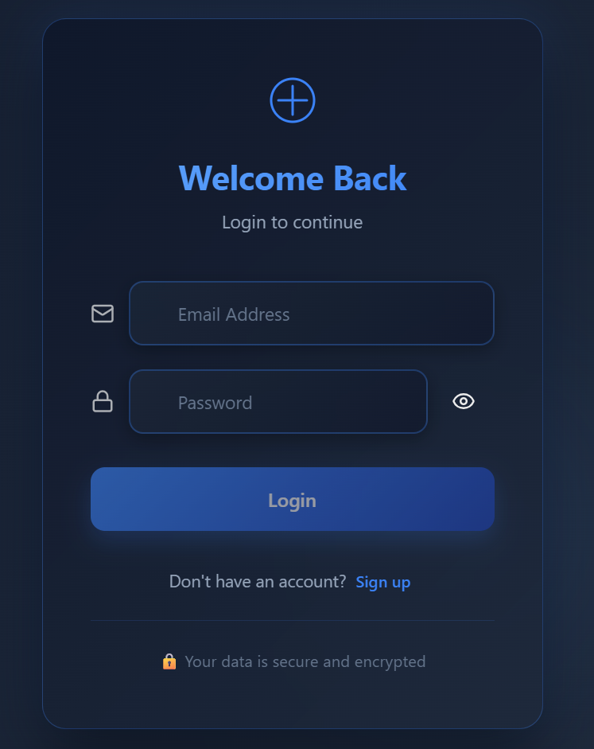
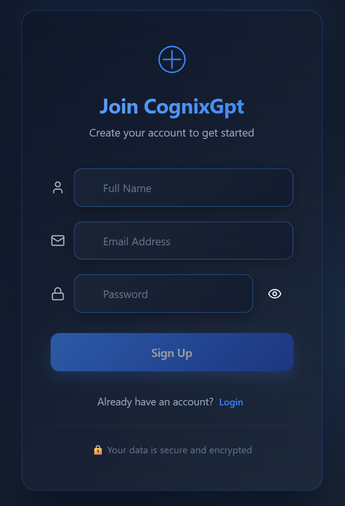
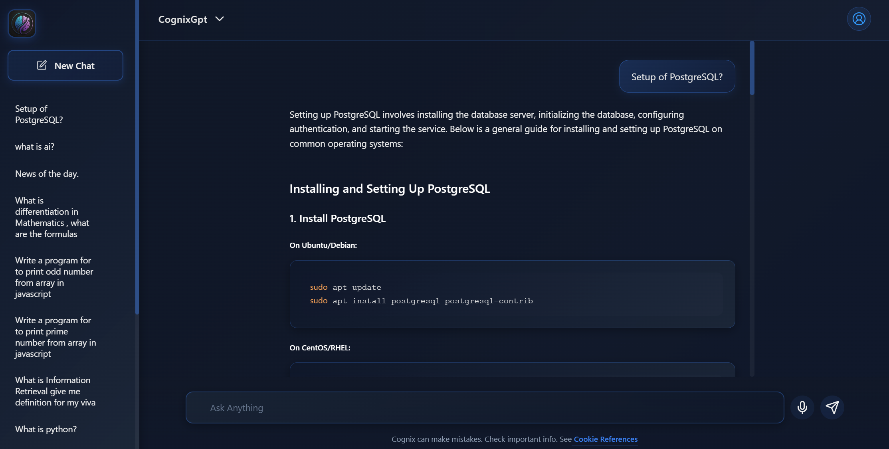
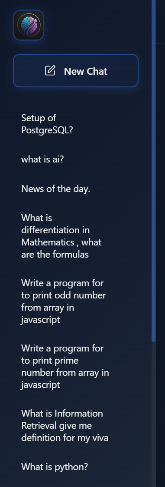

# CognixGPT – Full-Stack AI Personal Assistant

CognixGPT is a full-stack AI-powered personal assistant built using React.js, Node.js, Express.js, MongoDB Atlas, JWT Authentication, and OpenAI API. The application enables users to securely create accounts, manage private chat threads, interact with an AI assistant in real time, and access their conversation history across sessions.

## Key Features:
✅ AI-generated responses using OpenAI API
✅ Secure user authentication with JWT
✅ Password hashing for enhanced security
✅ Voice command support using Web Speech API
✅ User-specific chat history storage
✅ Thread-based conversation management
✅ MongoDB Atlas database integration
✅ Responsive and modern user interface

## Tech Stack:
Frontend: React.js, CSS, JavaScript
Backend: Node.js, Express.js
Database: MongoDB Atlas
Authentication: JWT, bcrypt
AI Integration: OpenAI API
Version Control: Git & GitHub

## Why I Built This
I built CognixGPT to gain hands-on experience with full-stack development, authentication systems, database management, API integration, and AI-powered applications. This project helped me understand how modern web applications securely manage users, store conversation history, and integrate with external AI services.

## Key Highlights

- Developed a full-stack AI-powered application using the MERN stack.
- Integrated OpenAI API for real-time AI responses.
- Implemented JWT authentication and password hashing for security.
- Added voice command functionality using the Web Speech API.
- Designed user-specific chat thread management.
- Stored conversation history securely in MongoDB Atlas.

## Application Preview

### User Login

### User Registration

### AI Chat Interface (Voice Commands Supported)

### Saved Chat History

